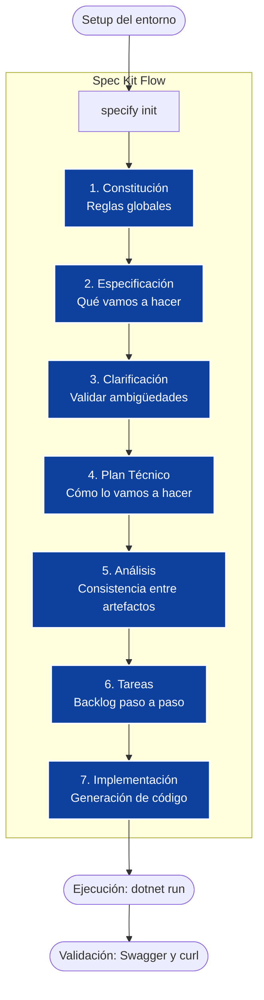

# Workshop Hands-On Lab (3 horas)

## GitHub Spec Kit + GitHub Copilot

### Desarrollo de una REST API Bancaria en .NET (sin base de datos)

> Laboratorio público: **NO usar datos reales, credenciales ni información sensible**
>
> Actualizado para **Spec Kit v0.7.0** — April 2026

---

## 1. Objetivo del workshop

Aprender a aplicar **Spec-Driven Development** usando GitHub Spec Kit y GitHub Copilot para construir una REST API bancaria en .NET de forma estructurada. Pasaremos de los requerimientos en lenguaje natural a código funcional, guiando a la Inteligencia Artificial paso a paso.

### ¿Por qué es importante especificar? (Spec-Driven Development)

En el desarrollo tradicional, saltar directamente a escribir código suele generar desalineación entre el negocio y la tecnología, resultando en bugs y retrabajos costosos. Al usar Inteligencia Artificial (como GitHub Copilot), la calidad del código generado depende **directamente** de la calidad del contexto proporcionado.

Especificar primero permite:

1. **Alinear expectativas:** Definir claramente el *Qué* antes del *Cómo*.
2. **Dar contexto a la IA:** Copilot funciona mucho mejor cuando entiende las reglas de negocio, la arquitectura y las restricciones antes de escribir la primera línea de código.
3. **Reducir deuda técnica:** Evitar refactorizaciones tempranas por malentendidos.
4. **Documentación viva:** La especificación se convierte en la fuente de verdad del proyecto.

### Resultado final (MVP)

Una API .NET funcional y minimalista que soporta:

- Consultar saldo de una cuenta (mock/in-memory)
- Transferencias entre cuentas (simulado)
- Swagger/OpenAPI habilitado

**Restricciones del laboratorio (Sin base de datos):**

- Repositorio en memoria usando colecciones concurrentes con seed data preconfigurado.
- Sin dependencias externas (ni SQL, ni Redis).
- Totalmente reproducible en cualquier máquina local.

---

## 2. Diagrama del flujo del laboratorio



### Comandos de Spec Kit — referencia completa

#### Comandos principales (core)

| Paso | Comando | Propósito |
|------|---------|-----------|
| 1 | `specify init . --ai copilot` | Inicializar el repositorio con Spec Kit configurado para GitHub Copilot. Crea `.specify/`, `specs/` y los scripts de soporte. |
| 2 | `/speckit.constitution` | Crear la constitución del proyecto: reglas globales, estándares de código, arquitectura y Definition of Done. Actúa como la "ley fundamental" del proyecto. |
| 3 | `/speckit.specify` | Generar la especificación funcional que define QUÉ debe hacer el sistema desde la perspectiva del negocio. |
| 4 | `/speckit.plan` | Crear el plan técnico: CÓMO se construirá el sistema, patrones, frameworks y arquitectura. |
| 5 | `/speckit.tasks` | Generar el backlog de tareas accionables y secuenciales desde el plan técnico. |
| 6 | `/speckit.implement` | Implementar el código fuente siguiendo especificaciones, plan y tareas. |

#### Comandos opcionales (calidad y validación)

| Comando | Cuándo usarlo |
|---------|---------------|
| `/speckit.clarify` | **Después de `/speckit.specify` y antes de `/speckit.plan`.** Identifica ambigüedades en los requerimientos. Recomendado en proyectos con reglas de negocio complejas. |
| `/speckit.analyze` | **Después de `/speckit.tasks` y antes de `/speckit.implement`.** Valida consistencia entre spec, plan y tareas. Detecta gaps antes de escribir código. |
| `/speckit.checklist` | Genera listas de verificación personalizadas para validar completitud y claridad de los requerimientos. |

*Nota: Los comandos `/speckit.*` se ejecutan en el chat de GitHub Copilot dentro de VS Code.*

---

## 3. Agenda detallada (3 horas)

| Tiempo | Actividad | Objetivo |
|--------|-----------|---------|
| 0:00–0:15 | Introducción | Alinear el enfoque Spec-Driven Development y el escenario bancario. |
| 0:15–0:30 | Setup + Inicialización | Tener el repositorio listo con Spec Kit y Copilot funcionando. |
| 0:30–0:50 | Constitución | Definir reglas no negociables (seguridad, calidad, testing, auditoría). |
| 0:50–1:10 | Especificación (Spec) | Definir QUÉ debe hacer la API: reglas de negocio y casos de uso. |
| 1:10–1:20 | Clarificación | Validar ambigüedades en la especificación antes de planificar. |
| 1:20–1:45 | Plan técnico (Plan) | Definir CÓMO implementarlo: arquitectura en memoria. |
| 1:45–1:55 | Análisis de consistencia | Verificar alineación entre spec, plan y futuros tasks. |
| 1:55–2:10 | Backlog (Tasks) | Convertir el plan técnico en tareas accionables. |
| 2:10–2:45 | Implementación | Generar, revisar y refinar el código con Copilot. |
| 2:45–3:00 | Demo + Cierre | Ejecutar la API y probar los endpoints. |

---

## 4. Prerrequisitos

### 4.1 Software requerido

**Git**
Descarga: https://git-scm.com/downloads
Validar: `git --version`

**.NET SDK 9**
Descarga: https://dotnet.microsoft.com/download
Validar: `dotnet --version`

**Visual Studio Code**
Descarga: https://code.visualstudio.com/
Extensiones requeridas:
- GitHub Copilot
- GitHub Copilot Chat
- C# Dev Kit

**GitHub Copilot activo**
Debes tener Copilot con sesión iniciada en VS Code y Copilot Chat funcionando.

**Python 3.11+**
Descarga: https://www.python.org/downloads/
Validar: `python --version`

**uv (gestor de paquetes Python)**
Instalación: https://github.com/astral-sh/uv

**Instalar Spec Kit CLI — versión v0.7.0 (recomendado)**

```bash
# Opción 1 — Instalación persistente con versión fija (recomendado)
uv tool install specify-cli --from git+https://github.com/github/spec-kit.git@v0.7.0

# Opción 2 — Instalación desde main (puede incluir cambios no liberados)
uv tool install specify-cli --from git+https://github.com/github/spec-kit.git
```

Validar:

```bash
specify --version
specify check
```

> **Nota sobre versiones:** Se recomienda fijar la versión (`@v0.7.0`) para evitar comportamientos inesperados si el repositorio upstream introduce cambios. Para upgrades futuros consultar el [Upgrade Guide oficial](https://github.com/github/spec-kit/blob/main/docs/upgrade.md).

### 4.2 Checklist de "listo para iniciar"

- [ ] `specify --version` muestra v0.7.0
- [ ] `specify check` no reporta herramientas faltantes
- [ ] Copilot Chat abre correctamente en VS Code
- [ ] El repositorio está abierto en VS Code con C# Dev Kit activo

---

## 5. Estructura esperada del repositorio

La herramienta `specify init` genera la siguiente estructura base. Tu proyecto al finalizar el laboratorio se verá así:

```
banking-speckit-dotnet-lab/
├── CLAUDE.md                      <-- Instrucciones del agente (generado por specify init)
├── .specify/
│   ├── memory/
│   │   ├── constitution.md        <-- Reglas globales del proyecto
│   │   └── project.md             <-- Política de idioma y contexto persistente
│   ├── scripts/
│   │   ├── check-prerequisites.sh
│   │   ├── common.sh
│   │   ├── create-new-feature.sh
│   │   ├── setup-plan.sh
│   │   └── update-claude-md.sh
│   └── templates/
│       ├── plan-template.md
│       ├── spec-template.md
│       └── tasks-template.md
├── specs/
│   └── 001-banking-api/
│       ├── spec.md                <-- Requerimientos de negocio
│       ├── plan.md                <-- Arquitectura y diseño
│       └── tasks.md               <-- Backlog de implementación
└── src/
    └── BankingApi/                <-- Código fuente .NET
```

---

## 6. Reglas del laboratorio

- Usar datos ficticios (Seed data).
- No subir secretos ni tokens al repositorio.
- No usar bases de datos reales (todo en memoria).
- Mantener el código limpio y revisar críticamente las sugerencias de la IA.

---

## Parte 1 — Inicialización del proyecto (0:15–0:30)

### Paso 1. Crear carpeta

```bash
mkdir banking-speckit-dotnet-lab
cd banking-speckit-dotnet-lab
```

### Paso 2. Inicializar Spec Kit

```bash
specify init . --ai copilot
```

Esto crea las carpetas `.specify/` y `specs/`, el archivo `CLAUDE.md`, y configura los scripts de soporte para que Copilot entienda que estamos usando Spec-Driven Development.

### Paso 3. Inicializar Git y abrir VS Code

```bash
git init
code .
```

### Paso 4. Configurar política de idioma (Memoria persistente)

Para asegurar que Spec Kit genere la documentación en español pero mantenga el código en inglés, crea el archivo `.specify/memory/project.md`:

```markdown
## Language Policy
- All human-readable documentation MUST be generated in Spanish.
- Source code MUST remain in English.
- API routes and identifiers remain in English.
```

---

## Parte 2 — Crear la Constitución (0:30–0:50)

**¿Qué es?** La constitución define las reglas de juego globales. Es el documento que Copilot leerá para saber qué estándares de código, arquitectura y seguridad debe respetar en todo momento. Se guarda en `.specify/memory/constitution.md`.

### Instrucciones en la interfaz de Copilot

1. Abre el panel de **GitHub Copilot Chat** en VS Code.
2. En el selector de modelos (parte superior del chat), elige **Claude 3.7 Sonnet** o **GPT-4o** para obtener el mejor razonamiento arquitectónico.
3. Escribe `/speckit.constitution` en la caja de texto.
4. Pega el prompt sugerido y presiona **Enter**.
5. Copilot te mostrará una vista previa del archivo `.specify/memory/constitution.md`. Haz clic en **"Apply in Editor"** y guarda (`Ctrl+S` / `Cmd+S`).

### Prompt sugerido

```
IMPORTANTE — IDIOMA:
- Genera toda la documentación en español.
- Mantén el código fuente en inglés.
- Mantén nombres técnicos en inglés (clases, métodos, endpoints).

IMPORTANTE — ESTRUCTURA DEL PROYECTO:
- Todo el código fuente DEBE ubicarse en la carpeta src/ en la raíz del repositorio.
- La estructura del proyecto debe ser: src/BankingApi/

Actúa como un Arquitecto de Software. Crea la constitución (reglas globales) para
una REST API bancaria empresarial en .NET.

Debes incluir:
- Política de Idioma: Documentos en español. Código, clases, métodos y variables en inglés.
- Estructura de Carpetas: Todo el código fuente dentro de src/ en la raíz del proyecto.
- Seguridad: Laboratorio de aprendizaje SIN autenticación, SIN autorización y SIN HTTPS.
  Enfocarse en la lógica de negocio únicamente.
- Logging estructurado con Correlation ID para trazabilidad.
- Validaciones estrictas en el dominio (ej. transferencias).
- Estándares de código C# (Clean Code, SOLID).
- Pruebas unitarias obligatorias.
- Swagger habilitado para documentación.
- Definition of Done (DoD) clara.
```

---

## Parte 3 — Crear la Especificación (0:50–1:10)

**¿Qué es?** Traduce los requerimientos del negocio a un formato estructurado. Aquí no hablamos de código, sino de casos de uso y reglas de negocio. Se guarda en `specs/001-banking-api/spec.md`.

### Instrucciones en la interfaz de Copilot

1. Escribe `/speckit.specify` en el chat.
2. Pega el prompt sugerido y presiona **Enter**.
3. Copilot generará `specs/001-banking-api/spec.md`. Haz clic en **"Apply in Editor"** y guarda.

### Prompt sugerido

```
IMPORTANTE — IDIOMA:
- Genera toda la documentación en español.
- Mantén el código fuente en inglés.

IMPORTANTE — ESTRUCTURA DEL PROYECTO:
- Todo el código fuente DEBE ubicarse en la carpeta src/ en la raíz del repositorio.

Crea la especificación funcional (spec.md) de una Banking REST API minimalista.

El sistema debe permitir SOLO 2 operaciones:
1. Consultar el saldo actual de una cuenta específica.
2. Transferir dinero entre dos cuentas.

Reglas de negocio estrictas:
- No permitir transferencias si la cuenta origen no tiene saldo suficiente.
- No permitir montos negativos o en cero.
- No permitir transferir a la misma cuenta.

Restricciones del laboratorio:
- API REST muy simple (MVP).
- Sin base de datos (almacenamiento en memoria).
- Datos semilla (seed data) al iniciar la aplicación con al menos 3 cuentas pre-cargadas
  (ej. ACC-001 con $1000, ACC-002 con $500, ACC-003 con $0) para poder probar inmediatamente.
```

---

## Parte 4 — Clarificación de requerimientos (1:10–1:20)

**¿Qué es?** Antes de generar el plan técnico, este paso valida que no existan ambigüedades en la especificación. Evita retrabajos en las fases de diseño e implementación.

> Este comando es **recomendado por el equipo de Spec Kit** como paso previo al plan técnico, especialmente en proyectos con reglas de negocio.

### Instrucciones en la interfaz de Copilot

1. Escribe `/speckit.clarify` en el chat.
2. Copilot revisará la especificación y hará preguntas sobre los puntos que identifique como ambiguos o incompletos.
3. Responde cada pregunta en el chat. Las respuestas quedan registradas en la sección "Clarifications" del `spec.md`.
4. Si todo está claro, puedes continuar al siguiente paso.

**Ejemplo de lo que Copilot podría preguntar:**

- ¿Qué debe ocurrir si la cuenta destino no existe?
- ¿El endpoint de consulta de saldo debe retornar el historial de transacciones o solo el saldo actual?
- ¿Qué formato de respuesta de error deben tener las validaciones fallidas?

---

## Parte 5 — Generar el Plan Técnico (1:20–1:45)

**¿Qué es?** Traduce la especificación a decisiones técnicas: arquitectura, patrones, frameworks. Se guarda en `specs/001-banking-api/plan.md`.

### Instrucciones en la interfaz de Copilot

1. Escribe `/speckit.plan` en el chat.
2. Pega el prompt sugerido y presiona **Enter**.
3. Copilot generará `specs/001-banking-api/plan.md`. Haz clic en **"Apply in Editor"** y guarda.

### Prompt sugerido

```
IMPORTANTE — IDIOMA:
- Genera toda la documentación en español.
- Mantén el código fuente en inglés.

IMPORTANTE — ESTRUCTURA DEL PROYECTO:
- Todo el código fuente DEBE ubicarse en la carpeta src/ en la raíz del repositorio.
- La estructura del proyecto debe ser: src/BankingApi/

Basado en la especificación anterior, crea el plan técnico (plan.md) para la Banking REST API.

Restricciones técnicas:
- .NET 9 Web API con ASP.NET Core (Minimal APIs o Controllers simples).
- El proyecto debe crearse en la carpeta src/BankingApi/
- SIN BASE DE DATOS: Usar un servicio Singleton en memoria con ConcurrentDictionary para
  almacenar los saldos.
- Arquitectura simplificada: Un solo proyecto separando lógicamente en carpetas
  (Models, Services, Controllers).
- Swagger habilitado.
- Pruebas unitarias básicas con xUnit solo para el servicio de transferencias.
```

---

## Parte 6 — Análisis de consistencia (1:45–1:55)

**¿Qué es?** Valida que spec, plan y las futuras tareas sean consistentes entre sí antes de generar el código. Detecta gaps o contradicciones antes de invertir tiempo en implementación.

### Instrucciones en la interfaz de Copilot

1. Escribe `/speckit.analyze` en el chat.
2. Copilot revisará los artefactos generados hasta este punto (spec.md y plan.md).
3. Si reporta inconsistencias, corrígelas antes de continuar al siguiente paso.

**¿Qué puede detectar este paso?**

- Casos de uso en la especificación que no están cubiertos en el plan técnico.
- Decisiones arquitectónicas en el plan que contradicen restricciones de la constitución.
- Dependencias técnicas no documentadas.

---

## Parte 7 — Generar Tasks (1:55–2:10)

**¿Qué es?** Divide el plan técnico en pasos accionables y pequeños. Se guarda en `specs/001-banking-api/tasks.md`.

### Instrucciones en la interfaz de Copilot

1. Escribe `/speckit.tasks` en el chat.
2. Pega el prompt sugerido y presiona **Enter**.
3. Copilot generará `specs/001-banking-api/tasks.md`. Haz clic en **"Apply in Editor"** y guarda.

### Prompt sugerido

```
IMPORTANTE — IDIOMA:
- Genera toda la documentación en español.
- Mantén el código fuente en inglés.

Basado en el plan técnico, genera un backlog de tareas (tasks.md) paso a paso
para implementar la API. Mantén el número de tareas al mínimo indispensable (máximo 5 tareas).

Las tareas deben ser secuenciales:
1. Crear proyecto Web API y xUnit.
2. Crear modelos de datos (Account, TransferRequest).
3. Crear el servicio en memoria con Seed Data (cuentas de prueba).
4. Crear los endpoints para consultar saldo y transferir.
5. Escribir pruebas unitarias para la lógica de transferencia.
```

---

## Parte 8 — Implementación con Copilot (2:10–2:45)

**¿Qué es?** El momento de codificar. Se toman las tareas del `tasks.md` y se le pide a Copilot Chat que genere el código tarea por tarea.

### Instrucciones en la interfaz de Copilot

1. Escribe `/speckit.implement` en el chat.
2. Copilot generará código fuente real (`.cs`, `.csproj`) dentro de `src/BankingApi/`.
3. Flujo de trabajo iterativo — para cada tarea:
   - Indica a Copilot: `@workspace Implementa la Tarea 1 del archivo tasks.md respetando la constitución y el plan técnico.`
   - Revisa el código generado, haz clic en **"Apply in Editor"** y verifica que compile.
   - Repite para las tareas siguientes.

**Tip:** Asegúrate de que Copilot incluya el Seed Data en el repositorio en memoria para tener cuentas con saldo inicial al arrancar.

---

## Parte 9 — Ejecutar la API (2:45–3:00)

### Restaurar y compilar

```bash
cd src/BankingApi
dotnet restore
dotnet build
```

### Ejecutar

```bash
dotnet run
```

### Abrir Swagger

```
http://localhost:5xxx/swagger
```

Reemplaza `5xxx` con el puerto que indique la consola al arrancar la aplicación.

---

## Pruebas con curl (alternativa a Swagger)

**Consultar saldo:**

```bash
curl http://localhost:5xxx/api/accounts/ACC-001
```

**Transferencia:**

```bash
curl -X POST http://localhost:5xxx/api/transfers \
  -H "Content-Type: application/json" \
  -d '{
    "fromAccountId": "ACC-001",
    "toAccountId": "ACC-002",
    "amount": 50.00
  }'
```

---

## Buenas prácticas aplicadas

Este laboratorio demuestra el valor de:

- **Spec-Driven Development:** La IA programa mejor cuando tiene contexto claro y estructurado antes de escribir código.
- **Clarificación antes de planificar:** Identificar ambigüedades temprano ahorra tiempo en refactorizaciones.
- **Análisis de consistencia:** Validar que los artefactos estén alineados antes de implementar reduce bugs de diseño.
- **Clean Architecture:** Separación de responsabilidades en un solo proyecto.
- **Validaciones de dominio:** Reglas de negocio protegidas en la capa de servicio.

## Siguientes pasos recomendados

Para llevar este MVP a un entorno productivo:

- Autenticación JWT / OAuth2.
- Persistencia real (SQL Server, PostgreSQL).
- Observabilidad avanzada (OpenTelemetry, Application Insights).
- CI/CD con GitHub Actions.
- Idempotencia en transferencias para evitar duplicidad.
- Explorar las [extensiones de la comunidad de Spec Kit](https://github.com/github/spec-kit#-community-extensions) para agregar flujos como integración con Azure DevOps, revisión de código post-implementación, o análisis de seguridad.

---

## Troubleshooting

**Copilot no ejecuta los comandos `/speckit.*`**
Verifica que el repositorio fue inicializado con `specify init . --ai copilot`. Los comandos solo están disponibles si la inicialización se completó correctamente. Ejecuta `specify check` para diagnosticar.

**`specify` no se encuentra en el PATH después de instalar**
Ejecuta `uv tool update-shell` o reinicia la terminal. En Windows puede ser necesario abrir una nueva sesión de PowerShell.

**Copilot genera código en versiones anteriores de .NET**
Menciona explícitamente `.NET 9 ASP.NET Core Web API` en cada prompt. Copilot usa el contexto del chat y puede perder la instrucción si el hilo es largo.

**Errores de concurrencia en tiempo de ejecución**
Al no usar base de datos, el repositorio en memoria debe usar `ConcurrentDictionary` y no `Dictionary` estándar, que no es thread-safe en ASP.NET Core.

**Errores SSL en curl**
Usa `-k` para ignorar advertencias de certificados locales, o accede por `http://` en lugar de `https://` durante el laboratorio.

**`specify init` falla en directorio no vacío**
Usa el flag `--force` para sobrescribir en un directorio con contenido existente: `specify init . --force --ai copilot`.

---

**Autor:** Armando Blanco
**Duración:** 3 horas
**Nivel:** Intermedio
**Modalidad:** Hands-On Lab público
**Spec Kit version:** v0.7.0
