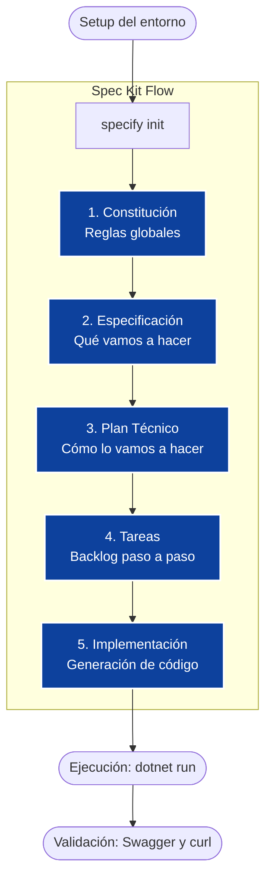

# Workshop Hands-On Lab (3 horas)
## GitHub Spec Kit + GitHub Copilot
### Desarrollo de una REST API Bancaria en .NET (sin base de datos)

> Laboratorio público: **NO usar datos reales, credenciales ni información sensible**

---

# 1. Objetivo del workshop

Aprender a aplicar **Spec-Driven Development** usando GitHub Spec Kit y GitHub Copilot para construir una REST API bancaria en .NET de forma estructurada. Pasaremos de los requerimientos en lenguaje natural a código funcional, guiando a la Inteligencia Artificial paso a paso.

## ¿Por qué es importante especificar? (Spec-Driven Development)
En el desarrollo tradicional, saltar directamente a escribir código suele generar desalineación entre el negocio y la tecnología, resultando en bugs y retrabajos costosos. 
Al usar Inteligencia Artificial (como GitHub Copilot), la calidad del código generado depende **directamente** de la calidad del contexto proporcionado. 

**Especificar primero** nos permite:
1. **Alinear expectativas:** Definir claramente el *Qué* antes del *Cómo*.
2. **Dar contexto a la IA:** Copilot funciona mucho mejor cuando entiende las reglas de negocio, la arquitectura y las restricciones antes de escribir la primera línea de código.
3. **Reducir deuda técnica:** Evitar refactorizaciones tempranas por malentendidos.
4. **Documentación viva:** La especificación se convierte en la fuente de la verdad del proyecto.

## Resultado final (MVP)

Una API .NET funcional y minimalista que soporta:
- Consultar saldo de una cuenta (mock/in-memory)  
- Transferencias entre cuentas (simulado)  
- Swagger/OpenAPI habilitado  

**Restricciones del laboratorio (Sin base de datos):**
- Repositorio en memoria (usando colecciones concurrentes) con *seed data* (datos iniciales).
- Sin dependencias externas (ni SQL, ni Redis).
- Totalmente reproducible en cualquier máquina local.

---

# 2. Diagrama del flujo del laboratorio

El siguiente diagrama ilustra el flujo de trabajo que seguiremos con Spec Kit:



## Comandos de Spec Kit en orden

| Paso | Comando | Propósito | Ejemplo de indicaciones |
|---:|---|---|---|
| 1 | `specify init . --ai copilot` | Inicializar el repositorio con Spec Kit y configurar para GitHub Copilot. Crea las carpetas `.specify/` y `specs/` con la configuración base. | Terminal: Ejecutar en la raíz del proyecto antes de comenzar |
| 2 | `/speckit.constitution` | Crear la constitución del proyecto: reglas globales, estándares de código, políticas de seguridad, arquitectura y Definition of Done. Actúa como la "ley fundamental" del proyecto. | Indicar: Política de idioma, estructura de carpetas, estándares C# (SOLID, Clean Code), requisitos de logging, validaciones obligatorias, configuración de pruebas |
| 3 | `/speckit.specify` | Generar la especificación funcional que define QUÉ debe hacer el sistema desde la perspectiva del negocio. Se enfoca en casos de uso y reglas de negocio, no en tecnología. | Indicar: Casos de uso principales (ej. consultar saldo, transferir), reglas de negocio (ej. no transferir si saldo insuficiente), restricciones (ej. sin DB, uso de seed data), actores involucrados |
| 4 | `/speckit.plan` | Crear el plan técnico que traduce la especificación a decisiones de implementación: CÓMO se construirá el sistema, qué patrones, frameworks y arquitectura usar. | Indicar: Stack tecnológico (.NET 8, ASP.NET Core), patrones arquitectónicos (repositories, services), estructura de carpetas (Models, Services, Controllers), decisiones de almacenamiento (ConcurrentDictionary en memoria) |
| 5 | `/speckit.tasks` | Generar el backlog de tareas accionables y secuenciales. Divide el plan técnico en pasos pequeños y específicos que se pueden implementar uno a uno. | Indicar: Priorización (crear proyecto primero, luego modelos, servicios, endpoints), definir número de tareas (ej. máximo 5), nivel de granularidad deseado |
| 6 | `/speckit.implement` | Implementar el código fuente basado en las especificaciones, plan y tareas. Genera archivos `.cs`, `.csproj` y demás código necesario siguiendo las reglas establecidas. | Indicar: Tarea específica del backlog a implementar (ej. "Implementa la Tarea 1"), confirmación de ubicación de archivos (src/), solicitar pruebas unitarias si aplica |

*Nota: Los comandos `/speckit.*` se ejecutan en el chat de GitHub Copilot dentro de VS Code.*

---

# 3. Agenda detallada (3 horas)

| Tiempo | Actividad | Objetivo |
|---:|---|---|
| 0:00–0:15 | Introducción | Alinear el enfoque Spec-Driven Development y el escenario bancario. |
| 0:15–0:35 | Setup + Inicialización | Tener el repositorio listo con Spec Kit y Copilot funcionando. |
| 0:35–0:55 | Constitución | Definir reglas no negociables (seguridad, calidad, testing, auditoría). |
| 0:55–1:20 | Especificación (Spec) | Definir QUÉ debe hacer la API (Reglas de negocio). |
| 1:20–1:50 | Plan técnico (Plan) | Definir CÓMO implementarlo (Arquitectura en memoria). |
| 1:50–2:10 | Backlog (Tasks) | Convertir el plan técnico en tareas accionables. |
| 2:10–2:45 | Implementación | Generar, revisar y refinar el código con Copilot. |
| 2:45–3:00 | Demo + Cierre | Ejecutar la API y probar los endpoints. |

---

# 4. Prerrequisitos

## 4.1 Software requerido

### 1. Git
Descarga: https://git-scm.com/downloads  
Validar: `git --version`

### 2. .NET SDK 8
Descarga: https://dotnet.microsoft.com/download  
Validar: `dotnet --version`

### 3. Visual Studio Code
Descarga: https://code.visualstudio.com/
Extensiones recomendadas:
- GitHub Copilot  
- GitHub Copilot Chat  
- C# Dev Kit (o C#)  
- Python (solo para la CLI de Spec Kit)  
- Markdown Preview Mermaid Support (opcional)  

### 4. Acceso a GitHub Copilot
Debes tener:
- Copilot activo y sesión iniciada en VS Code.
- Copilot Chat funcionando.

### 5. Python 3.11+ (solo para Spec Kit CLI)
Descarga: https://www.python.org/downloads/  
Validar: `python --version`

### 6. Instalar Spec Kit (Specify CLI)

**Opción A — pip**
```bash
pip install specify-cli
```

**Opción B — uv (recomendada)**
UV: https://github.com/astral-sh/uv
```bash
uv tool install specify-cli --from git+https://github.com/github/spec-kit.git
```

Validar:
```bash
specify --help
```

## 4.2 Checklist de “listo para iniciar”
- [ ] Puedo ejecutar `specify --help`  
- [ ] Copilot Chat abre correctamente en VS Code  
- [ ] El repositorio está abierto en VS Code  

---

# 5. Estructura esperada del repositorio

Al finalizar el laboratorio, tu proyecto se verá así:

```text
banking-speckit-dotnet-lab/
├─ .specify/                 <-- Contexto global para Copilot
│  └─ memory/
│     └─ project.md          <-- Memoria persistente (Idioma)
├─ specs/
│  └─ 001-banking-api/
│     ├─ spec.md             <-- Requerimientos de negocio
│     ├─ plan.md             <-- Arquitectura y diseño
│     └─ tasks.md            <-- Backlog de implementación
└─ src/
   └─ BankingApi/            <-- Código fuente .NET
```

---

# 6. Reglas del laboratorio

✔ Usar datos ficticios (Seed data).  
✔ No subir secretos ni tokens.  
✔ No usar bases de datos reales (todo en memoria).  
✔ Mantener el código limpio y seguir las sugerencias de la IA con criterio crítico.  

---

# Parte 1 — Inicialización del proyecto (0:15–0:35)

## Paso 1. Crear carpeta
```bash
mkdir banking-speckit-dotnet-lab
cd banking-speckit-dotnet-lab
```

## Paso 2. Inicializar Spec Kit
```bash
specify init . --ai copilot
```
*Nota: Esto crea las carpetas `.specify/` y `specs/`, configurando las instrucciones base para que Copilot entienda que estamos usando Spec-Driven Development.*

## Paso 3. Inicializar Git y abrir VS Code
```bash
git init
code .
```

## Paso 4. Configurar el Idioma Persistente (Memoria PRO)
Para asegurar que Spec Kit genere la documentación en español pero mantenga el código en inglés (estándar de la industria), crearemos una regla en la memoria persistente del proyecto.

Crea el archivo `.specify/memory/project.md` y agrega lo siguiente:

```markdown
## Language Policy
- All human-readable documentation MUST be generated in Spanish.
- Source code MUST remain in English.
- API routes and identifiers remain in English.
```
*Nota: Esto actúa como memoria permanente del agente para todo el repositorio.*

---

# Parte 2 — Crear la Constitución (0:35–0:55)

**¿Qué es?** La constitución define las reglas de juego globales. Es el documento que Copilot leerá para saber qué estándares de código, arquitectura y seguridad debe respetar en todo momento.

### Instrucciones en la interfaz de Copilot:
1. Abre el panel de **GitHub Copilot Chat** en VS Code.
2. En el selector de modelos (parte superior del chat), asegúrate de elegir **GPT-4o** o **Claude 3.5 Sonnet** para obtener el mejor razonamiento arquitectónico.
3. Escribe el comando `/speckit.constitution` en la caja de texto.
4. Pega el **Prompt sugerido** (abajo) y presiona **Enviar**.
5. **Creación del archivo:** Copilot procesará la solicitud y te mostrará una vista previa de los cambios para el archivo `.specify/memory/constitution.md`. Haz clic en **"Apply in Editor"** (Aplicar en el editor) y luego guarda el archivo (`Ctrl+S` / `Cmd+S`).
6. **Siguiente paso:** En la parte inferior de la respuesta de Copilot, verás un menú desplegable que dice **"PROCEED FROM SPECKIT.CONSTITUTION"**. Selecciona **"Build Specification"** para avanzar a la siguiente fase de forma fluida.

### Prompt sugerido:
```text
IMPORTANTE — IDIOMA:
- Genera toda la documentación en español.
- Mantén el código fuente en inglés.
- Mantén nombres técnicos en inglés (clases, métodos, endpoints).

IMPORTANTE — ESTRUCTURA DEL PROYECTO:
- Todo el código fuente DEBE ubicarse en la carpeta src/ en la raíz del repositorio.
- La estructura del proyecto debe ser: src/BankingApi/

Actúa como un Arquitecto de Software. Crea la constitución (reglas globales) para una REST API bancaria empresarial en .NET.

Debes incluir:
- Política de Idioma: Todos los documentos generados deben estar en español. El código, clases, métodos y variables permanecen en inglés.
- Estructura de Carpetas: Todo el código fuente debe ubicarse dentro de src/ en la raíz del proyecto.
- Seguridad: Este es un laboratorio de aprendizaje SIN autenticación, SIN autorización y SIN HTTPS. Enfocarse en la lógica de negocio únicamente.
- Logging estructurado con Correlation ID para trazabilidad.
- Validaciones estrictas en el dominio (ej. transferencias).
- Estándares de código C# (Clean Code, SOLID).
- Pruebas unitarias obligatorias.
- Swagger habilitado para documentación.
- Definition of Done (DoD) clara.
```

---

# Parte 3 — Crear la Especificación (0:55–1:20)

**¿Qué es?** Traduce los requerimientos del negocio a un formato estructurado. Aquí no hablamos de código, sino de casos de uso y reglas de negocio.

### Instrucciones en la interfaz de Copilot:
1. Si seleccionaste **"Build Specification"** en el paso anterior, el chat ya estará listo. Si no, escribe el comando `/speckit.specify`.
2. Pega el **Prompt sugerido** y presiona **Enviar**.
3. **Creación del archivo:** Copilot generará el archivo `specs/001-banking-api/spec.md`. Revisa el contenido, haz clic en **"Apply in Editor"** y guarda el archivo.
4. **Siguiente paso:** En el menú desplegable **"PROCEED FROM SPECKIT.SPECIFY"**, selecciona **"Build Plan"**.

### Prompt sugerido:
```text
IMPORTANTE — IDIOMA:
- Genera toda la documentación en español.
- Mantén el código fuente en inglés.
- Mantén nombres técnicos en inglés (clases, métodos, endpoints).

IMPORTANTE — ESTRUCTURA DEL PROYECTO:
- Todo el código fuente DEBE ubicarse en la carpeta src/ en la raíz del repositorio.
- La estructura del proyecto debe ser: src/BankingApi/

Crea la especificación funcional (spec.md) de una Banking REST API minimalista.

El sistema debe permitir SOLO 2 operaciones:
1. Consultar el saldo actual de una cuenta específica.
2. Transferir dinero entre dos cuentas.

Reglas de negocio estrictas:
- No permitir transferencias si la cuenta origen no tiene saldo suficiente.
- No permitir montos negativos o en cero.
- No permitir transferir a la misma cuenta.

Restricciones del laboratorio:
- API REST muy simple (MVP).
- Sin base de datos (almacenamiento en memoria).
- Datos semilla (seed data) al iniciar la aplicación con al menos 3 cuentas pre-cargadas (ej. ACC-001 con $1000, ACC-002 con $500, ACC-003 con $0) para poder probar inmediatamente.
```

---

# Parte 4 — Generar el Plan Técnico (1:20–1:50)

**¿Qué es?** Traduce la especificación a decisiones técnicas (arquitectura, patrones, frameworks). Le dice a Copilot *cómo* construirlo.

### Instrucciones en la interfaz de Copilot:
1. Asegúrate de estar en el paso `/speckit.plan` (seleccionado desde el menú anterior o escribiéndolo manualmente).
2. Pega el **Prompt sugerido** y presiona **Enviar**.
3. **Creación del archivo:** Copilot generará el archivo `specs/001-banking-api/plan.md`. Haz clic en **"Apply in Editor"** y guarda.
4. **Siguiente paso:** En el menú desplegable, selecciona **"Build Tasks"**.

### Prompt sugerido:
```text
IMPORTANTE — IDIOMA:
- Genera toda la documentación en español.
- Mantén el código fuente en inglés.
- Mantén nombres técnicos en inglés (clases, métodos, endpoints).

IMPORTANTE — ESTRUCTURA DEL PROYECTO:
- Todo el código fuente DEBE ubicarse en la carpeta src/ en la raíz del repositorio.
- La estructura del proyecto debe ser: src/BankingApi/

Basado en la especificación anterior, crea el plan técnico (plan.md) para la Banking REST API.

Restricciones técnicas para acelerar el desarrollo:
- .NET 8 Web API con ASP.NET Core (Minimal APIs o Controllers simples).
- El proyecto debe crearse en la carpeta src/BankingApi/
- SIN BASE DE DATOS: Usar un servicio Singleton en memoria con un `ConcurrentDictionary` para almacenar los saldos.
- Arquitectura simplificada: Un solo proyecto (sin múltiples capas físicas) separando lógicamente en carpetas (Models, Services, Controllers).
- Swagger habilitado.
- Pruebas unitarias básicas con xUnit solo para el servicio de transferencias.
```

---

# Parte 5 — Generar Tasks (1:50–2:10)

**¿Qué es?** Divide el plan técnico en pasos accionables y pequeños. Esto evita que la IA se abrume y cometa errores al intentar generar todo el proyecto de una vez.

### Instrucciones en la interfaz de Copilot:
1. Usa el comando `/speckit.tasks` (o continúa desde el menú desplegable anterior).
2. Pega el **Prompt sugerido** y presiona **Enviar**.
3. **Creación del archivo:** Copilot generará el archivo `specs/001-banking-api/tasks.md` con el backlog. Haz clic en **"Apply in Editor"** y guarda.
4. **Siguiente paso:** En el menú desplegable, selecciona **"Implement"**.

### Prompt sugerido:
```text
IMPORTANTE — IDIOMA:
- Genera toda la documentación en español.
- Mantén el código fuente en inglés.
- Mantén nombres técnicos en inglés (clases, métodos, endpoints).

Basado en el plan técnico, genera un backlog de tareas (tasks.md) paso a paso para implementar la API. 
Mantén el número de tareas al mínimo indispensable (máximo 5 tareas).
Las tareas deben ser secuenciales:
1. Crear proyecto Web API y xUnit.
2. Crear modelos de datos (Account, TransferRequest).
3. Crear el servicio en memoria con Seed Data (cuentas de prueba).
4. Crear los endpoints (Controllers o Minimal APIs) para consultar saldo y transferir.
5. Escribir pruebas unitarias para la lógica de transferencia.
```

---

# Parte 6 — Implementación con Copilot (2:10–2:45)

**¿Qué es?** El momento de codificar. Iremos tomando tarea por tarea del `tasks.md` y le pediremos a Copilot Chat que genere el código.

### Instrucciones en la interfaz de Copilot:
1. Usa el comando `/speckit.implement` o simplemente `@workspace`.
2. **Creación de archivos:** A diferencia de los pasos anteriores donde se creaba un solo archivo Markdown, aquí Copilot generará código fuente real (`.cs`, `.csproj`) dentro de la carpeta `src/BankingApi/`.
3. **Flujo de trabajo iterativo:**
   - Pide a Copilot: `@workspace Implementa la Tarea 1 del archivo tasks.md respetando la constitución y el plan técnico.`
   - Revisa el código generado, haz clic en **"Apply in Editor"** para los archivos correspondientes y verifica que compile.
   - Repite para las siguientes tareas (Modelos, Repositorio en memoria, Servicios, Controladores).

*Tip: Asegúrate de que Copilot genere el "Seed Data" en el repositorio en memoria para tener cuentas con saldo inicial (ej. ACC-001 con $1000).*

---

# Parte 7 — Ejecutar la API (2:45–3:00)

## Restaurar y compilar
```bash
cd src/BankingApi
dotnet restore
dotnet build
```

## Ejecutar
```bash
dotnet run
```

## Abrir Swagger
Abre tu navegador en la URL que indique la consola, agregando `/swagger`:
```
http://localhost:5xxx/swagger
```

---

# Pruebas con curl (Opcional si no usas Swagger)

## Consultar saldo
```bash
curl -k http://localhost:5xxx/api/accounts/ACC-001
```

## Transferencia
```bash
curl -k -X POST http://localhost:5xxx/api/transfers \
  -H "Content-Type: application/json" \
  -d '{
    "fromAccountId": "ACC-001",
    "toAccountId": "ACC-002",
    "amount": 50.00
  }'
```

---

# Buenas prácticas aplicadas

Este laboratorio demuestra el valor de:
- **Spec-Driven Development:** La IA programa mejor cuando le damos contexto claro.
- **Clean Architecture:** Separación de responsabilidades.
- **Validaciones de dominio:** Reglas de negocio protegidas.
- **Diseño cloud-ready:** Listo para evolucionar.

# Siguientes pasos recomendados

Para llevar este MVP a un entorno productivo real:
- Autenticación JWT / OAuth2.
- Persistencia real (SQL Server, PostgreSQL).
- Observabilidad avanzada (OpenTelemetry, Application Insights).
- CI/CD con GitHub Actions.
- Idempotencia en transferencias para evitar duplicidad.

---

# Troubleshooting

- **Copilot no genera .NET correctamente:** Asegúrate de mencionar explícitamente `.NET 8 ASP.NET Core Web API` en tus prompts.
- **Errores de concurrencia:** Al no usar base de datos, asegúrate de que el repositorio en memoria use colecciones seguras para hilos (`ConcurrentDictionary`).
- **Errores SSL en curl:** Usa la bandera `-k` para ignorar advertencias de certificados locales, o usa la URL `http` en lugar de `https`.

---

**Autor:** Armando Blanco  
**Duración:** 3 horas  
**Nivel:** Intermedio  
**Modalidad:** Hands-On Lab público  
